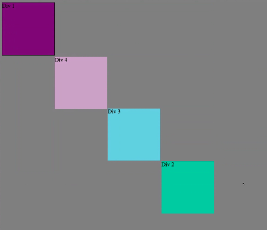

How can you use Chrome's DevTools inspector to help you format or position elements?
It allows one to navigate an html/css document quickly, and find the exact elements you want. Once you're there, you can edit each and every element in any way you want.

How can you resize elements on the DOM using CSS?
Click on an element that you want to resize. Then enter in the new height and width that you want the element to be.

What are the differences between Absolute, Fixed, Static, and Relative positioning? Which did you find easiest to use? Which was most difficult?
Absolute position lets one move an element in relation to where it was. Fixed places something relative to the browser window, where it will stay no matter where you scroll. Static is the default position, which renders things in the order they appear. Relative position places an element in relation to where it would normally appear in Static position. I found Absolute to be the easiest, and Relative to be the most difficult.

What are the differences between Margin, Border, and Padding?
The margin is the distance between an element and other elements. The border is the size of the line around the element, and its style. The padding is the distance between the border, and whatever you have inside of the element.

What was your impression of this challenge overall? (love, hate, and why?)
This challenge was incredibly frustrating. Many of the normal css controls did not work the way they are supposed to. For example, setting an element to a width of 100% did not cause it fill the entire screen, and we could not figure out why.