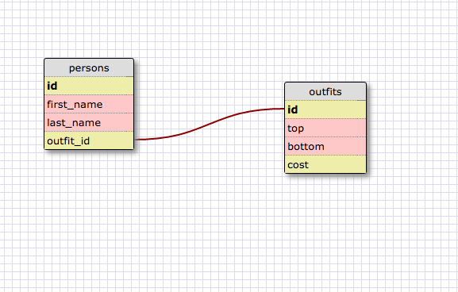

What are databases for?
Databases are for storing a large amount of information. Databases are useful because they allow one to easily access the information stored inside of it.

What is a one-to-many relationship?
A one-to-many relationship means that while an object1 may be linked to several different other object2s, each of those object2s is only linked to a single object1. For example, a homeroom teacher has many students, but each student only has one homeroom teacher.

What is a primary key? What is a foreign key? How can you determine which is which?
A primary key is linked to every object stored in the database. A foregin key links each object to a different table in the database. The difference is that every object only has one primary key, but you can repeat foregin keys.

How can you select information out of a SQL database? What are some general guidelines for that?
The general syntax is to type SELECT object FROM table;
Always remember that you have to end with a semicolon. You can also access information from different tables by typing SELECT table1.object, table2.object FROM table1, and then typing in the appropriate joining operator.