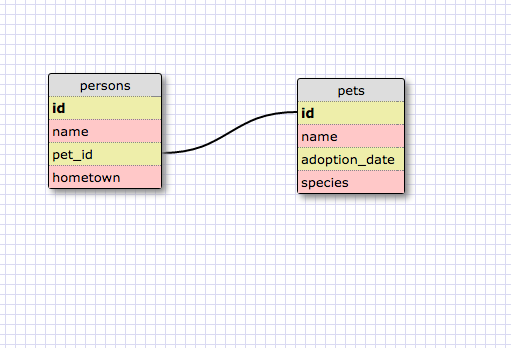
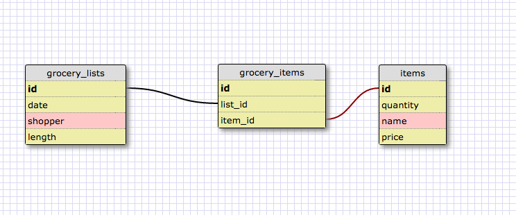

This is a one-to-one relationship because (unless there are couples in the database, or one person has multiple pets), then each pet will only have a single owner.

What is a one-to-one database?
A one-to-one database is a database where two tables are linked together, and only one object is linked to a single other object.

When would you use a one-to-one database? (Think generally, not in terms of the example you created).
You would use one when you want to display two related things in two different tables, and each object in these tables only relate to one thing in the other table.

What is a many-to-many database?
A many-to-many database has several objects from one table linked to several objects in another table. This requires a third table to link them both.

When would you use a many-to-many database? (Think generally, not in terms of the example you created).
You would need this type of database for situations when there are many objects from one table interacting with many from the other.

What is confusing about database schemas? What makes sense?
Schemas are confusing mostly because SQL is not a very intuitive system so far. They make sense conceptually though. Having a way to visualize it with Schema Designer is very helpful.